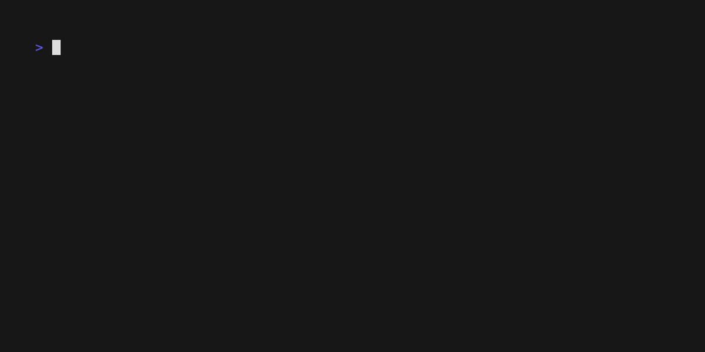

<div align="center">
  

  # Tsarr

  **All your *arr apps. One CLI. One SDK.**

  [](https://www.npmjs.com/package/tsarr)
  [](https://www.npmjs.com/package/tsarr)
  [](https://github.com/robbeverhelst/Tsarr/actions)

  <br />

  

</div>

Tsarr is a CLI and TypeScript SDK for Radarr, Sonarr, Lidarr, Readarr, Prowlarr, Bazarr, qBittorrent, and Jellyseerr / Overseerr — eight services, one tool. Clients are generated directly from each project's official OpenAPI spec, so they're type-safe and stay in sync with upstream automatically. Drive it from your terminal, your scripts, your CI, or import it as a library.

## Install

```bash
# CLI (global) or SDK (project dependency)
npm install -g tsarr        # or: npm install tsarr

# Homebrew (macOS / Linux)
brew install robbeverhelst/tsarr/tsarr

# Standalone binary (no runtime needed)
curl -fsSL https://github.com/robbeverhelst/tsarr/releases/latest/download/tsarr-$(uname -s | tr A-Z a-z)-$(uname -m | sed 's/x86_64/x64/;s/aarch64/arm64/') -o /usr/local/bin/tsarr && chmod +x /usr/local/bin/tsarr
```

<details>
<summary>Other install methods (Bun, Docker, Scoop, Chocolatey, AUR, Nix, manual binaries)</summary>

```bash
# Bun
bun add -g tsarr             # or: bun add tsarr

# Docker
docker run --rm ghcr.io/robbeverhelst/tsarr doctor

# Scoop (Windows)
scoop bucket add tsarr https://github.com/robbeverhelst/scoop-tsarr
scoop install tsarr

# Chocolatey (Windows)
choco install tsarr

# AUR (Arch)
yay -S tsarr-bin

# Nix
nix profile install github:robbeverhelst/tsarr?dir=packaging/nix
```

Pre-built binaries for every platform are published on each [GitHub release](https://github.com/robbeverhelst/tsarr/releases). See [docs/distribution.md](./docs/distribution.md) for the full distribution flow.

</details>

## 🤖 Run Tsarr from chat

Tsarr ships as an [OpenClaw](https://openclaw.ai/) skill — point a local AI assistant at your stack and manage it from WhatsApp, Telegram, Discord, or Slack.

```bash
openclaw clawhub install tsarr
```

> [!TIP]
> Once installed, talk to your media stack in plain English:
>
> *"Add Dune Part Two to my 4K Radarr and let me know when it's ready."*
>
> *"What's queued in Sonarr right now? Anything stuck?"*
>
> *"Search Prowlarr for the new Radiohead release and send the best result to qBittorrent."*

The skill itself lives in [`skills/tsarr/`](./skills/tsarr) in this repo, so improvements ship alongside the CLI.

## CLI

```bash
# One-time setup — interactive wizard
tsarr config init

# Verify everything's reachable
tsarr doctor

# Use it
tsarr radarr movie search --term "Interstellar"
```

<div align="center">
  
</div>

The CLI follows a predictable `tsarr <service> <resource> <action>` shape across all services, with `--json` / `--table` / `--quiet` output modes, shell completions, and a `doctor` command that pings every configured service.

> [!NOTE]
> Got more than one Radarr (or Sonarr, or anything else)? Give each one a name in your config and pick which to use with `--instance 4K`. See the [CLI guide](./docs/cli.md#multi-instance) for setup.

See the full **[CLI guide](./docs/cli.md)** for every command, scripting examples, output formats, and shell completions.

## SDK

Use Tsarr from any TypeScript / JavaScript project. Same coverage as the CLI, with full types generated from each upstream OpenAPI spec.

```ts
import { RadarrClient } from 'tsarr/radarr';

const radarr = new RadarrClient({
  baseUrl: 'http://localhost:7878',
  apiKey: process.env.RADARR_API_KEY!,
});

const movies = await radarr.getMovies();
```

```ts
// Import only what you need — modular per-service entrypoints
import { SonarrClient } from 'tsarr/sonarr';
import type { SeriesResource } from 'tsarr/sonarr/types';
```

```ts
// Compose multiple services — one mental model, full types end-to-end
import { RadarrClient } from 'tsarr/radarr';
import { SonarrClient } from 'tsarr/sonarr';

const radarr = new RadarrClient({ baseUrl: 'http://radarr:7878', apiKey: '...' });
const sonarr = new SonarrClient({ baseUrl: 'http://sonarr:8989', apiKey: '...' });

const [movies, series] = await Promise.all([radarr.getMovies(), sonarr.getSeries()]);
console.log(`Library: ${movies.data?.length ?? 0} movies, ${series.data?.length ?? 0} series.`);
```

See the **[SDK guide](./docs/usage.md)** and [auto-generated API docs](https://robbeverhelst.github.io/Tsarr/) for the full surface.

## Supported services

<table>
  <tr>
    <td width="40"></td>
    <td><strong>Radarr</strong> — movie collection manager</td>
    <td width="40"></td>
    <td><strong>Sonarr</strong> — TV series collection manager</td>
  </tr>
  <tr>
    <td></td>
    <td><strong>Lidarr</strong> — music collection manager</td>
    <td></td>
    <td><strong>Readarr</strong> — book &amp; audiobook manager</td>
  </tr>
  <tr>
    <td></td>
    <td><strong>Prowlarr</strong> — indexer manager</td>
    <td></td>
    <td><strong>Bazarr</strong> — subtitle manager</td>
  </tr>
  <tr>
    <td></td>
    <td><strong>qBittorrent</strong> — download client</td>
    <td></td>
    <td><strong>Jellyseerr / Overseerr</strong> — media requests<br /><sub>(<code>seerr</code> subcommand, compatible with both)</sub></td>
  </tr>
</table>

<sub>Logos belong to their respective projects. Tsarr is an independent client — not affiliated with the Servarr team, qBittorrent, Jellyseerr, or Overseerr.</sub>

## Docs

- **[CLI guide](./docs/cli.md)** — every command, every flag
- **[SDK guide](./docs/usage.md)** — typed clients, modular imports
- **[Examples](./docs/examples.md)** — real-world automation scripts
- **[API reference](https://robbeverhelst.github.io/Tsarr/)** — generated TypeScript docs

## Support this project

If Tsarr saves you time, [sponsorship on GitHub](https://github.com/sponsors/robbeverhelst) is appreciated.

## Contributing

PRs welcome — see [CONTRIBUTING.md](./CONTRIBUTING.md). Bug reports and feature requests go in [GitHub Issues](https://github.com/robbeverhelst/Tsarr/issues).

## Credits

Built on the work of the [Servarr](https://wiki.servarr.com/), [qBittorrent](https://www.qbittorrent.org/), [Jellyseerr](https://docs.jellyseerr.dev/), and [Overseerr](https://overseerr.dev/) projects. Tsarr is just the glue.

## License

MIT — see [LICENSE](LICENSE).
